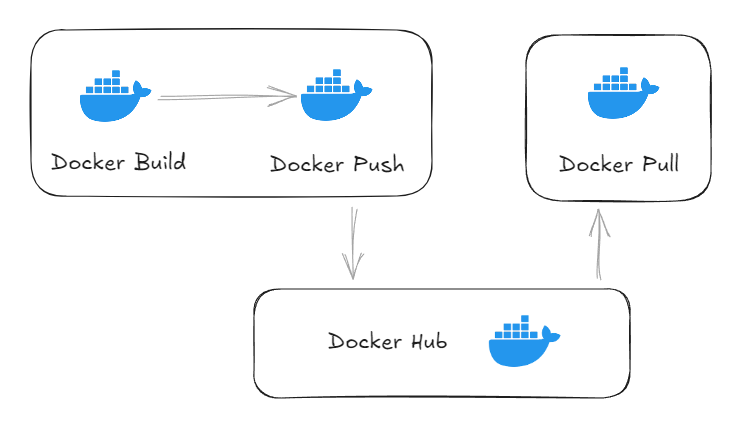

เนื้อหาที่คุณต้องการครอบคลุมทั้ง DevOps, Containerization, Networking, Reverse Proxy, Scaling และ LLM Stack
ผมจะจัดให้เป็น **Production-Oriented Curriculum Blueprint** แบบเป็นระบบ เหมาะกับสาย Backend/Infra ที่ต้องการทำระบบจริง

---

# 🧱 Module 1 — Container Foundation (Docker Core)

## 1. Docker Architecture


### 1.1 Docker Image Management

* Image คืออะไร: Template สำหรับสร้าง container ที่ประกอบด้วย OS, dependencies, และ application code
​

* Docker Registry: Docker Hub, private registry, และการ pull/push images

* Image Layers: แนวคิด layer-based architecture เพื่อประหยัดพื้นที่

* Image Tagging: การจัดการ version ด้วย tags

* ลบและทำความสะอาด images: docker image prune, docker rmi

### 1.2 Dockerfile

* โครงสร้าง Dockerfile: FROM, WORKDIR, COPY, ADD, RUN, CMD, ENTRYPOINT, EXPOSE

* Multi-stage builds: ลดขนาด image สำหรับ production

* Best practices: การเรียงลำดับ instructions เพื่อใช้ cache ได้ดี

* .dockerignore: ไฟล์ที่ไม่ต้องการ copy เข้า image

* Environment variables: ARG vs ENV

### 1.3 การจัดการ Build

* Build context: การเลือก files ที่จำเป็น

* Build arguments: ส่งค่าตอน build time

* Build cache: การใช้ cache ให้มีประสิทธิภาพ

* BuildKit: ฟีเจอร์ใหม่ที่ build เร็วขึ้น

* Multi-platform builds: สร้าง image สำหรับหลาย architecture

---

## 2. Build / Push / Pull Flow




### Commands

```bash
# Build
docker build -t myapp:1.0 .

# Tag for registry
docker tag myapp:1.0 myrepo/myapp:1.0

# Push
docker push myrepo/myapp:1.0

# Pull
docker pull myrepo/myapp:1.0
```

---

# 🧩 Module 2 — Docker Compose (Service Orchestration)

###  Docker Compose Introduction

docker-compose.yml structure: version, services, networks, volumes

Service definition: image, build, container_name, restart policies

คำสั่งพื้นฐาน: docker compose up, down, ps, logs, exec

depends_on: กำหนดลำดับการ start services

Environment variables: .env file และ environment section


## 1. Basic docker-compose.yml

```yaml
version: "3.9"

services:
  backend:
    build: .
    ports:
      - "8000:8000"
    volumes:
      - .:/app
    depends_on:
      - db

  db:
    image: postgres:15
    environment:
      POSTGRES_USER: admin
      POSTGRES_PASSWORD: secret
    volumes:
      - db_data:/var/lib/postgresql/data

volumes:
  db_data:
```

---

## 🧩 2. Volume (Persistent Storage)


### Volume Management

* Named volumes: เก็บข้อมูลถาวรนอก container lifecycle
* Bind mounts: mount โฟลเดอร์จาก host เข้า container
* tmpfs mounts: mount in-memory filesystem


``` yaml
    volumes:
        db-data:
            driver: local
        
        services:
        database:
            volumes:
            - db-data:/var/lib/postgresql/data
            - ./config:/etc/config:ro

```


---

## 3. Network

* Port Mapping และ Networking
* Port binding: ports: "8080:80" - host:container
* Expose: เปิด port ให้ services อื่นใน network เดียวกัน
* Network modes: bridge (default), host, none
* Custom networks: สร้าง isolated networks

``` yaml
networks:
  frontend:
    driver: bridge
  backend:
    driver: bridge

```

---

## 4. Limit CPU / RAM


* Memory limits: จำกัด RAM ที่ container ใช้ได้
* CPU limits: จำกัด CPU shares หรือ CPU cores
* Reservations vs Limits: ความต่างระหว่างการจอง vs ขีดจำกัด

```yaml
services:
  backend:
    deploy:
      resources:
        limits:
          cpus: '0.5'
          memory: 512M
        reservations:
          cpus: '0.25'
          memory: 256M

```

> ใช้ได้เต็มใน Docker Swarm หรือ Compose v3+

---

# ⚖️ Module 3 — Scaling & Load Balancing

## 1. Replica

* Deploy replicas: สร้างหลาย instances ของ service เดียวกัน
* Scale command: `docker compose up --scale web=3`
* Load distribution: Docker's round-robin DNS
* Update และ rollback strategies: rolling updates

```bash
services:
  api:
    image: myapi:latest
    deploy:
      replicas: 3
      update_config:
        parallelism: 1
        delay: 10s
      restart_policy:
        condition: on-failure

```

## 2. Load Balancer Concept


---

## 3. Traefik Reverse Proxy


Traefik คือ Dynamic Reverse Proxy

### Example

```yaml
services:
  traefik:
    image: traefik:v2.10
    command:
      - "--providers.docker=true"
      - "--entrypoints.web.address=:80"
    ports:
      - "80:80"
    volumes:
      - /var/run/docker.sock:/var/run/docker.sock
```


